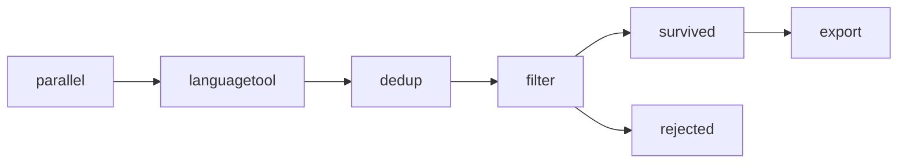

# Pipeline

Each node is a CLI (`peratrasher-<name>`). Stages from **parallel** through **dedup** are signal-only — every input row gets new keys under `metrics.*` and may have new entries in `removal_reasons`, but no rows are dropped. **filter** is the only step that splits the corpus; rejected rows are written to a parallel file with a `filtered_by` list naming every rule they violated. **export** projects survivors to a chosen column subset and writes ZSTD-compressed parquet for HuggingFace `datasets`.

### Configured filters / parameters

**parallel**
- wikificator (src)
- citations (src + tgt)
- ftfy (src + tgt)
- nfkc (src + tgt)
- length_ratio: 0.5 ≤ ratio ≤ 2.5, slack = 5 words
- bi_glotlid: score_threshold = 0.55, min_words = 5

**languagetool**
- language: be-BY
- exclude_proper_nouns: true (skip capitalised non-initial / pure-Latin tokens)

**dedup**
- MinHash-LSH via text-dedup
- threshold = 0.8, ngram_size = 5, num_perm = 128, min_length = 5

**filter** (AND-combined, fail any → reject)
- `no_objections` — `removal_reasons` must be empty
- `narkamaŭka_density` — `src_langtool.density ≤ 0.1`
- `at_most_zero_unknown_word` — `src_langtool.types.misspelling ≤ 0`
- `not_a_duplicate` — `dedup_keeper == true`

**export**
- format: parquet, compression: zstd
- columns: `uniq_id, src_text, tgt_text, src_lang, tgt_lang`
